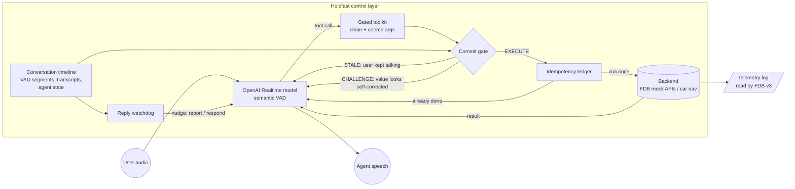

# Holdfast: an interruptible real-time voice agent

**Theme 05, Interruptible Real-Time Agents.** Holdfast is a LiveKit voice agent that stays
responsive while people hesitate, pause and correct themselves. It never acts on a request
the user is still changing, and never performs the same action twice.

- **Model provider (declared):** OpenAI Realtime API, `gpt-realtime-1.5`, the same model as the
  published GPT-Realtime baseline. Holdfast's contribution is the control layer around it.
- **Benchmark:** Full-Duplex-Bench v3, harness pinned at commit `3e799c4`, scored by its own
  scripts with its gpt-4o judge.
- **Extension:** Holdfast Drive, a hands-free in-car assistant ([details](#extension-holdfast-drive)).

## Why a control layer

Reading the FDB-v3 harness source, three facts decide the score:

1. **Every executed tool call counts.** The agent logs a call when the tool actually runs, and
   the strict pass check fails a scenario on any missing, **extra** or wrong call. Same-named
   calls are paired in order. A call made on a half-finished sentence ("Lisbon, no wait,
   Porto") is permanent, even if the agent later fixes it.
2. **LiveKit does not cancel running tools on barge-in.** It waits for them to finish. Delaying
   a tool is not enough; the tool itself has to notice that the user kept talking.
3. **Silence loses.** Response quality is judged from what the agent *says*. Correct tool calls
   followed by no speech still lose the scenario.

The published baselines lose most of their points exactly there: self-corrections and
multi-step chains.

## Architecture



| Component | File | What it does |
|---|---|---|
| Conversation timeline | `holdfast/timeline.py` | Records user speech segments, transcripts, agent state and tool activity from LiveKit session events. |
| Commit gate | `holdfast/gate.py` | Holds each call until the user has been silent for a settle window (0.35 s read-only, 0.9 s state-changing). **STALE** if the user kept talking after the call was issued, or barged in; nothing runs, and the model is told to re-issue with final values. **CHALLENGE** (once) if the transcript shows the value was self-corrected. A cap stops background noise from starving execution. |
| Repair detector | `holdfast/repair.py` | Flags an argument when a repair marker ("no wait", "actually", "sorry", "I mean", ...) directly follows its last mention and the value isn't restated. Used only to *challenge*, never to rewrite, so a false positive costs one round trip, never a wrong action. |
| Idempotency ledger | `holdfast/ledger.py` | Semantically identical calls run once. Repeats get the cached result, concurrent duplicates join the first run, failures are not cached. Optional state context makes "text my ETA" after a reroute a new action rather than a duplicate. |
| Gated toolkit | `holdfast/toolkit.py` | Turns plain tool specs into LiveKit raw-schema tools, cleans arguments against the schema, and writes the harness's exact telemetry line **only for calls that executed**. Also writes an audit log of every gate decision. |
| Reply watchdog | `holdfast/watchdog.py` | If tools finished and the agent stayed silent (2.5 s), or a real transcribed request got no reaction (6 s), it asks the model to report or act. Never while anyone is speaking; capped per conversation. |
| Prompt | `holdfast/prompts.py` | Disfluency rules: the last stated value wins, abandoned requests are dropped, act in the order asked, chain on returned ids, never invent optional values, never claim "done" early. Examples are invented, not drawn from the benchmark. |
| Benchmark agent | `agents/fdb_agent.py` | Drop-in replacement for the reference `lk_agent_tool.py`: same dispatch, same telemetry files. Fresh control layer and backend per room, so nothing carries across scenarios. |

Everything runs asynchronously. Mock backend calls go to a worker thread, because the harness's
latency injector uses a blocking `sleep`, so the conversation loop is never blocked.

## Quick start (benchmark)

Requirements: Linux, Python ≥ 3.10, `git`, `ffmpeg`, an NVIDIA GPU for the harness's NeMo ASR
(CPU works, slowly), a free [LiveKit Cloud](https://cloud.livekit.io) project, and an OpenAI API key.

```bash
cp .env.example .env      # fill in LIVEKIT_URL, LIVEKIT_API_KEY, LIVEKIT_API_SECRET, OPENAI_API_KEY
./reproduce.sh            # install -> fetch harness + data -> self-test -> run -> score -> summary
```

`reproduce.sh` does, in order:

1. checks prerequisites and `.env`
2. clones FDB-v3 at the pinned commit
3. builds two isolated virtualenvs (`.venv-agent`, and `.venv-harness` with NeMo)
4. runs the unit tests and the offline harness self-test, **before spending any API money**
5. downloads the benchmark audio (or uses `FDB_DATA_DIR`)
6. writes a manifest (commits, resolved config, `pip freeze` for both environments, GPU)
7. starts the agent, waits for LiveKit registration, runs the harness's inference driver, and
   scores with the benchmark's three evaluation scripts (`--use-llm`)
8. copies all logs and per-scenario results into `results/runs/<UTC timestamp>/` and prints a summary

Useful variants:

```bash
RUNS=3 ./reproduce.sh                         # 3 full runs, mean ± std in summary.md
FDB_DATA_DIR=/data/fdb_v3_data_released ./reproduce.sh
HOLDFAST_SET="tools.schema=template" ./reproduce.sh   # reference tool schema (see below)
SKIP_INSTALL=1 DATASET=devset ./reproduce.sh  # our own dev set (see devset/README.md)
```

**API keys:** `LIVEKIT_URL`, `LIVEKIT_API_KEY`, `LIVEKIT_API_SECRET` (LiveKit Cloud) and
`OPENAI_API_KEY` (agent model and benchmark judge) go in `.env`. No keys are included. Use a LiveKit
project with no other agents deployed, because the agent auto-joins every new room.

**Reproducibility.** Every version is pinned (`requirements-*.txt`), as is the harness commit. The
OpenAI Realtime API accepts no seed and ignores `temperature`, so single runs vary. Use `RUNS=3`
and compare against the mean ± std in `summary.md`. All Holdfast logic is deterministic given the
same event timing.

## Offline checks (no keys needed)

```bash
python -m pytest -q tests                 # 93 tests
python scripts/harness_selftest.py        # real FDB-v3 pipeline + scorers, scripted model
python scripts/drive_sim.py               # extension control logic
```

`harness_selftest.py` runs the harness's real `process_single()` and its real scorers on three
invented scenarios. Only the LiveKit transport and the NeMo ASR are replaced with stand-ins; a
scripted "model" reproduces three documented failure modes. With Holdfast: 3/3 pass. With calls
executed immediately, like the reference agent: 0/3 (an extra stale call, a wrong corrected
argument, a duplicate action). **This verifies the wiring and the control logic. It does not
predict the real model's score; only a real run does that.**

## Tool schema (disclosure)

`tools.schema` selects how the 12 benchmark tools are exposed to the model:

- **`extended` (default).** Same 12 tools and backend. `search_apartments` needs only `city`;
  `bedrooms` and `max_price` become optional, where the reference schema requires them and so
  forces the model to invent values the user never said. Two optional filters are added:
  `search_apartments.pets_allowed` and `search_products.category`. We noticed these parameter
  *names* while reading the benchmark's expected-call schema to check chaining conventions. No
  scenario text or values are used anywhere.
- **`template`.** Exactly the reference agent's parameters and requiredness.

When `bedrooms` or `max_price` is omitted, a shim passes neutral defaults to the mock function
(which requires them positionally). The telemetry log records only what the agent sent. If the
organizers prefer the reference schema, run with `HOLDFAST_SET="tools.schema=template"`; nothing
else changes.

## Fair-play statement

- No benchmark items are hardcoded, memorized or used for tuning. The prompt examples, the
  self-test scenarios and the dev set are original.
- No external servers at evaluation time beyond the declared OpenAI API (plus LiveKit Cloud,
  which the harness requires).
- A fresh backend, ledger, gate and timeline per LiveKit room: no state crosses scenarios.

## Tuning without touching the test set

`devset/` holds 20 original scenarios in the benchmark's format (all 12 tools, all 5 disfluency
types, 1–3 chained calls). Voice them with TTS (`--tts`) for quick iteration, or better, import
recordings of your own team (`--recordings DIR`). Then run the identical pipeline with
`DATASET=devset`. Every gate, watchdog and turn-detection setting is a config key, e.g.
`HOLDFAST_SET="gate.settle_write_s=1.2,turn_detection.eagerness=low"`.

## Extension: Holdfast Drive

A hands-free in-car assistant on the **same** control layer, with different tools:
`set_destination`, `get_eta`, `find_nearby`, `add_stop`, `send_eta`, `cancel_navigation`. The mock
navigation backend is fictional and deterministic, and deliberately slow (route computation 2 s)
so the background work is visible. A terminal dashboard prints the real navigation state on every
change, so the video shows what actually happened, not just what the agent said.

```bash
python agents/drive_agent.py console      # local mic + speaker; needs only OPENAI_API_KEY (+ PortAudio)
```

Things to try, and what must happen:

| Say | Expected |
|---|---|
| "Take me to the airport... actually no, Central Station." | One route, to Central Station. The early "airport" call is held and dropped. |
| "Text Maya my ETA." then later "Text Maya my ETA." | One message. The repeat is recognized as already done. |
| "Change of plan, Harbor Market, and tell Maya." | The route is **replaced**, not duplicated. Maya gets an explicit *update*. |
| "Find a charger on the way and add the closest one." | Asynchronous search, then `add_stop` using the returned id. The ETA grows by the detour. |

Files: `extension/nav_backend.py`, `extension/drive_tools.py`, `extension/dashboard.py`,
`agents/drive_agent.py`. The offline check is `scripts/drive_sim.py`.

## Repository layout

```
holdfast/            control layer (timeline, gate, repair, ledger, toolkit, watchdog, prompts, runtime)
agents/              fdb_agent.py (benchmark), drive_agent.py (extension)
extension/           in-car backend, tools, dashboard
scripts/             harness_selftest.py, drive_sim.py, fetch_fdb_data.py, summarize_results.py
devset/              original dev scenarios + builder
config/holdfast.yaml every tunable
tests/               93 unit/integration tests
reproduce.sh         one-command benchmark reproduction
```

## What we would do next

- Sweep settle windows and VAD eagerness on the recorded dev set, trading tool-call latency
  against stale calls.
- Replace the lexical repair detector with a small streaming classifier over partial transcripts.
- Speculative execution for read-only tools: run early, commit the result only if the gate
  agrees. This lowers latency without logging stale calls; it needs a harness-side distinction
  between speculative and committed calls.
- Compensating actions for state changes that already ran (e.g. "undo that booking").

## References

- Lin et al., *Full-Duplex-Bench-v3: Benchmarking Tool Use for Full-Duplex Voice Agents Under
  Real-World Disfluency*, arXiv:2604.04847.
- Harness: https://github.com/DanielLin94144/Full-Duplex-Bench (v3, commit `3e799c4`).
- LiveKit Agents 1.8.3; OpenAI Realtime API.
